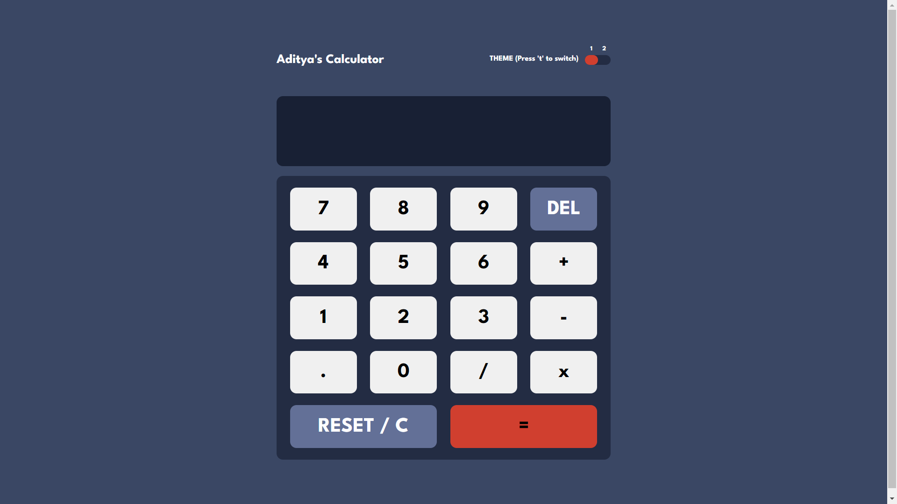

# Frontend Mentor - Calculator app solution

This is a solution to the [Calculator app challenge on Frontend Mentor](https://www.frontendmentor.io/challenges/calculator-app-9lteq5N29). Frontend Mentor challenges help you improve your coding skills by building realistic projects. 

## Table of contents

- [Overview](#overview)
  - [The challenge](#the-challenge)
  - [Screenshot](#screenshot)
  - [Links](#links)
- [My process](#my-process)
  - [Built with](#built-with)
  - [What I learned](#what-i-learned)
- [Author](#author)
- [Acknowledgments](#acknowledgments)

## Overview

### The challenge

Users should be able to:

- See the size of the elements adjust based on their device's screen size
- Perform mathmatical operations like addition, subtraction, multiplication, and division
- Adjust the color theme based on their preference
- **Bonus**: Have their initial theme preference checked using `prefers-color-scheme` and have any additional changes saved in the browser

### Screenshot



### Links

- Solution URL: [Solution URL](https://www.frontendmentor.io/challenges/calculator-app-9lteq5N29/hub/calculator-app-made-with-html-css-js-_lGmcRyiBT)
- Live Site URL: [Live site URL](https://adityaraj5200.github.io/Calculator-App/)

## My process

### Built with

- Semantic HTML5 markup
- CSS custom properties
- JavaScript
- Flexbox

### What I learned

With this project, I learned implementing two different themes(light and dark) in a single webpage.
Also brushed up my JavaScript a bit more with this project.


```js
/* Learned how to implement two different theems through this JS code */
let style1_path = "style1.css"
let style2_path = "style2.css"

let link = document.createElement('link');
link.rel = "stylesheet";
link.href = style1_path;

let head = document.getElementsByTagName('head')[0];
head.appendChild(link);

let curr_theme;

function apply_style1(){
    curr_theme = 1;
    link.href = style1_path;
}

function apply_style2(){
    curr_theme = 2;
    link.href = style2_path;
}

apply_style1();
```

## Author

- Frontend Mentor - [@adityaraj5200](https://www.frontendmentor.io/profile/adityaraj5200)
- Twitter - [@adityaraj5200](https://www.twitter.com/adityaraj5200)


## Acknowledgments

I would like to acknowledge me and only me 😎😏 to make this awesome calculator. It was only me who did all the work to make it. Hahaha! 😎😏